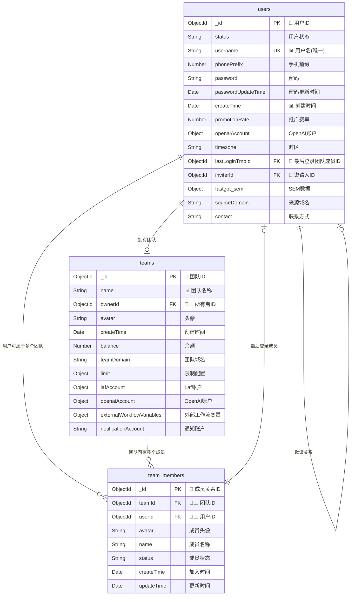
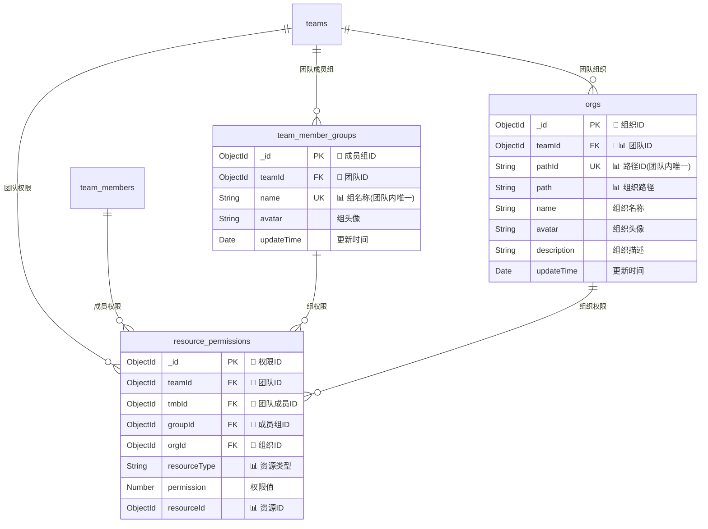
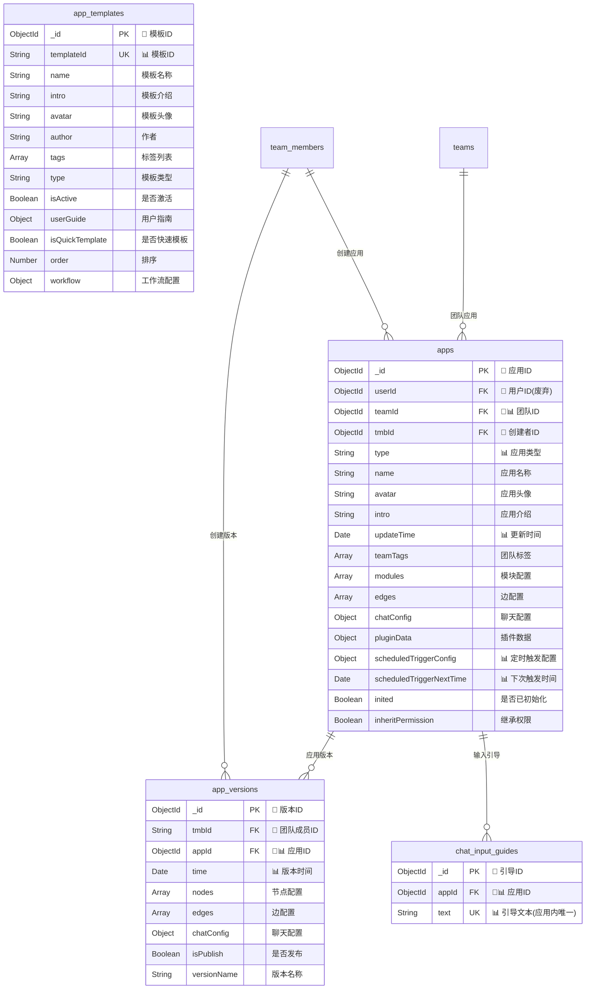
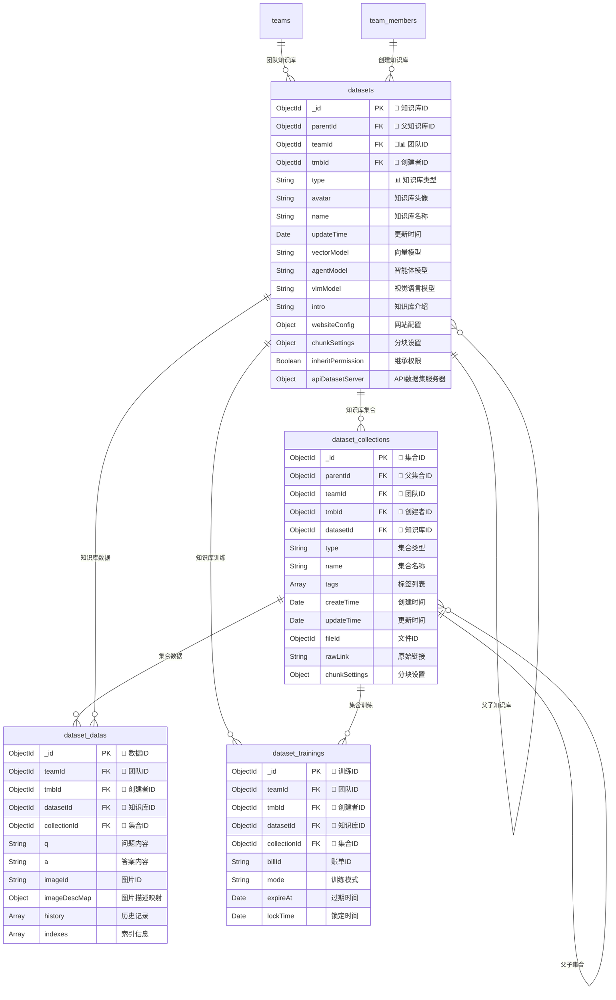
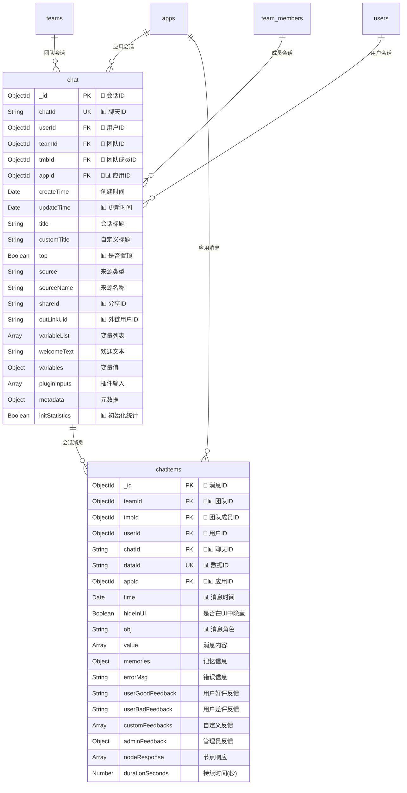
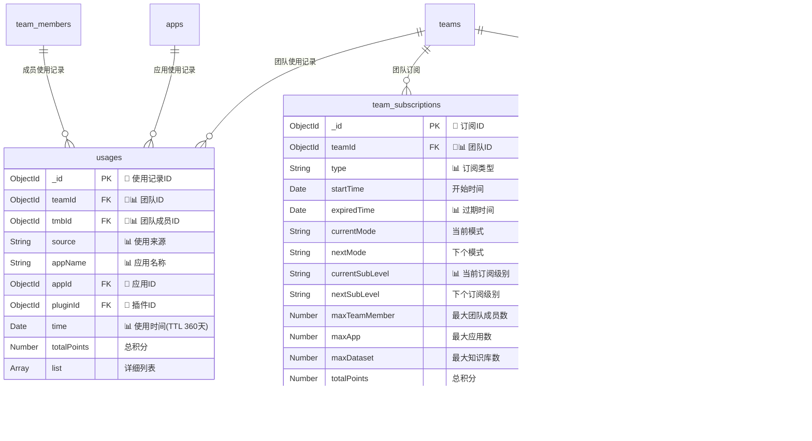
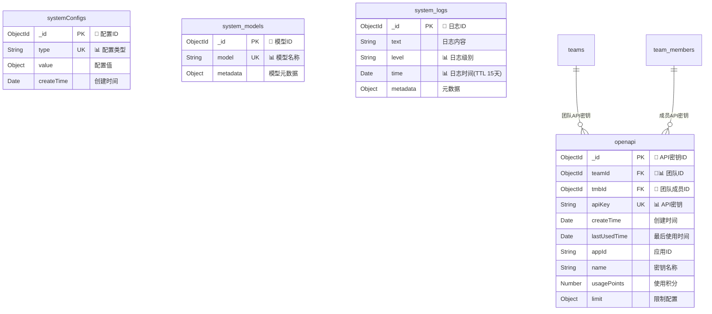
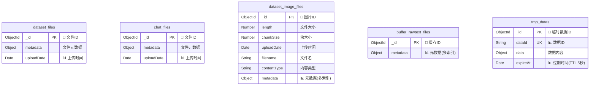
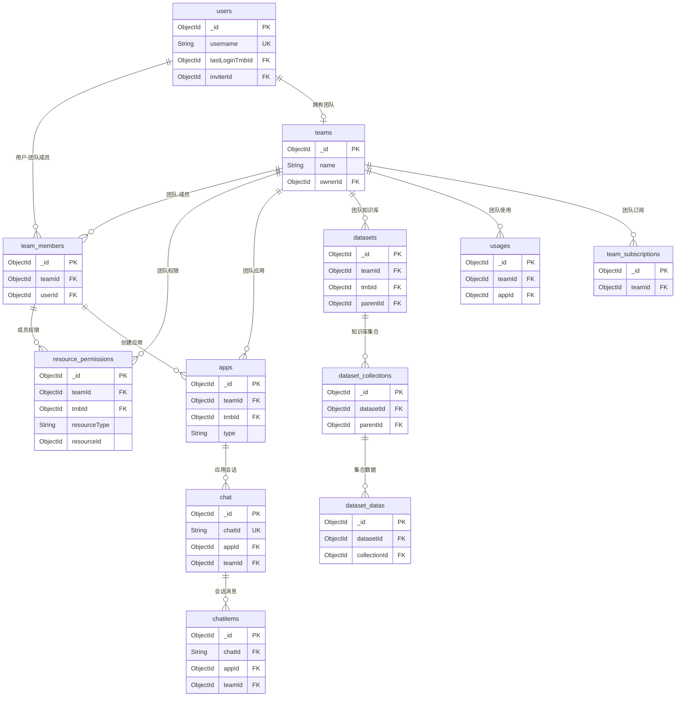

# FastGPT MongoDB 数据库 ER 图

本文档提供了 FastGPT 项目 MongoDB 数据库的实体关系图（Entity Relationship Diagram）。

## ER 图说明

### 图例
- **实体（表）**: 矩形框表示
- **主键**: 🔑 标识
- **外键**: 🔗 标识
- **关系**: 线条连接，标注关系类型（1:1, 1:N, N:M）
- **索引**: 📊 标识重要索引字段

---

## 核心业务模块 ER 图

### 用户与团队管理模块

### 权限管理模块

### 应用管理模块

### 知识库管理模块

### 聊天管理模块

### 钱包与订阅模块

### 系统管理模块

### 文件存储模块

---

## 完整系统 ER 图概览

---

## 关系类型说明

### 一对一关系 (1:1)
- `users.lastLoginTmbId` → `team_members._id`
- `teams.ownerId` → `users._id`

### 一对多关系 (1:N)
- `teams` → `team_members` (一个团队有多个成员)
- `users` → `team_members` (一个用户可以是多个团队的成员)
- `datasets` → `dataset_collections` (一个知识库有多个集合)
- `dataset_collections` → `dataset_datas` (一个集合有多个数据)
- `apps` → `chat` (一个应用有多个聊天会话)
- `chat` → `chatitems` (一个会话有多个消息)

### 多对多关系 (N:M)
- `users` ↔ `teams` (通过 `team_members` 中间表)
- `resource_permissions` 连接多个实体的权限关系

### 自引用关系
- `users.inviterId` → `users._id` (用户邀请关系)
- `datasets.parentId` → `datasets._id` (知识库父子关系)
- `dataset_collections.parentId` → `dataset_collections._id` (集合父子关系)

---

## 索引策略总结

### 主键索引
所有表的 `_id` 字段都是主键索引

### 唯一索引
- `users.username` - 用户名唯一
- `system_models.model` - 模型名称唯一
- `systemConfigs.type` - 配置类型唯一
- `team_sub_coupons.key` - 优惠券密钥唯一
- `tmp_datas.dataId` - 临时数据ID唯一

### 复合索引
- `(teamId, updateTime)` - 团队相关的时间查询
- `(appId, chatId)` - 应用聊天查询
- `(teamId, resourceType, resourceId)` - 权限查询
- `(teamId, name)` - 团队内名称唯一性

### TTL索引（自动过期）
- `system_logs.time` - 15天后自动删除
- `usages.time` - 360天后自动删除
- `tmp_datas.expireAt` - 5秒后自动删除

---

## 数据完整性约束

### 外键约束
1. **用户相关**:
   - `team_members.userId` → `users._id`
   - `team_members.teamId` → `teams._id`
   - `teams.ownerId` → `users._id`

2. **应用相关**:
   - `apps.teamId` → `teams._id`
   - `apps.tmbId` → `team_members._id`
   - `chat.appId` → `apps._id`
   - `chatitems.appId` → `apps._id`

3. **知识库相关**:
   - `datasets.teamId` → `teams._id`
   - `dataset_collections.datasetId` → `datasets._id`
   - `dataset_datas.datasetId` → `datasets._id`
   - `dataset_datas.collectionId` → `dataset_collections._id`

4. **权限相关**:
   - `resource_permissions.teamId` → `teams._id`
   - `resource_permissions.tmbId` → `team_members._id`

### 业务规则约束
1. **团队成员唯一性**: 同一用户在同一团队中只能有一个成员记录
2. **权限继承**: 子资源可以继承父资源的权限设置
3. **软删除**: 重要数据采用状态标记而非物理删除
4. **数据归属**: 所有业务数据都必须归属于某个团队

---

## 性能优化建议

### 查询优化
1. **分页查询**: 使用 `limit` 和 `skip` 进行分页
2. **投影查询**: 只查询需要的字段，减少网络传输
3. **聚合管道**: 使用 MongoDB 聚合框架进行复杂查询

### 索引优化
1. **复合索引顺序**: 根据查询频率和选择性排序
2. **稀疏索引**: 对可选字段使用稀疏索引
3. **部分索引**: 对特定条件的文档建立索引

### 数据分片
1. **按团队分片**: 以 `teamId` 作为分片键
2. **按时间分片**: 对时序数据按时间分片
3. **按地理位置分片**: 对全球部署按地区分片

这个 ER 图展示了 FastGPT 系统完整的数据库设计，包括所有表的结构、关系和约束，为系统的开发、维护和优化提供了重要参考。