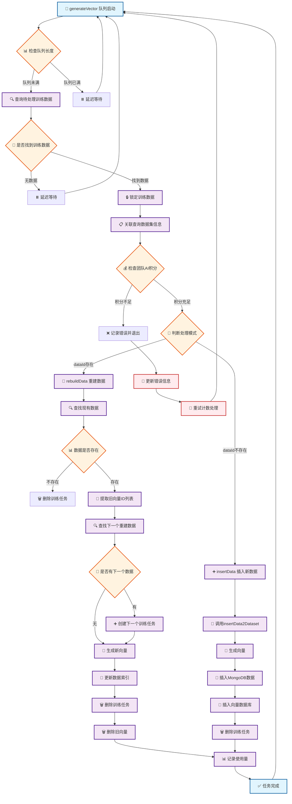
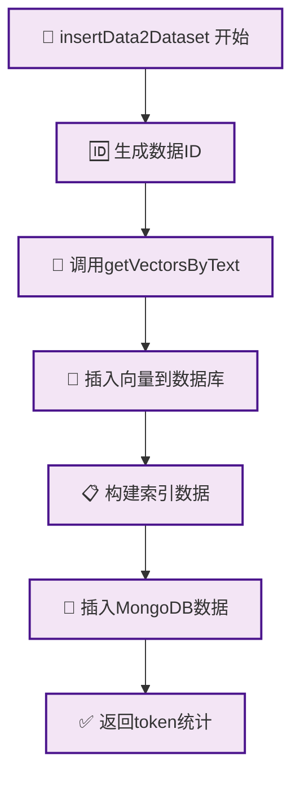
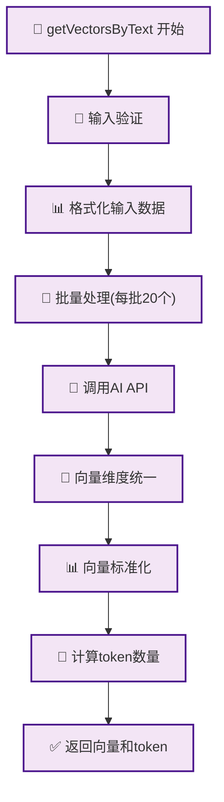
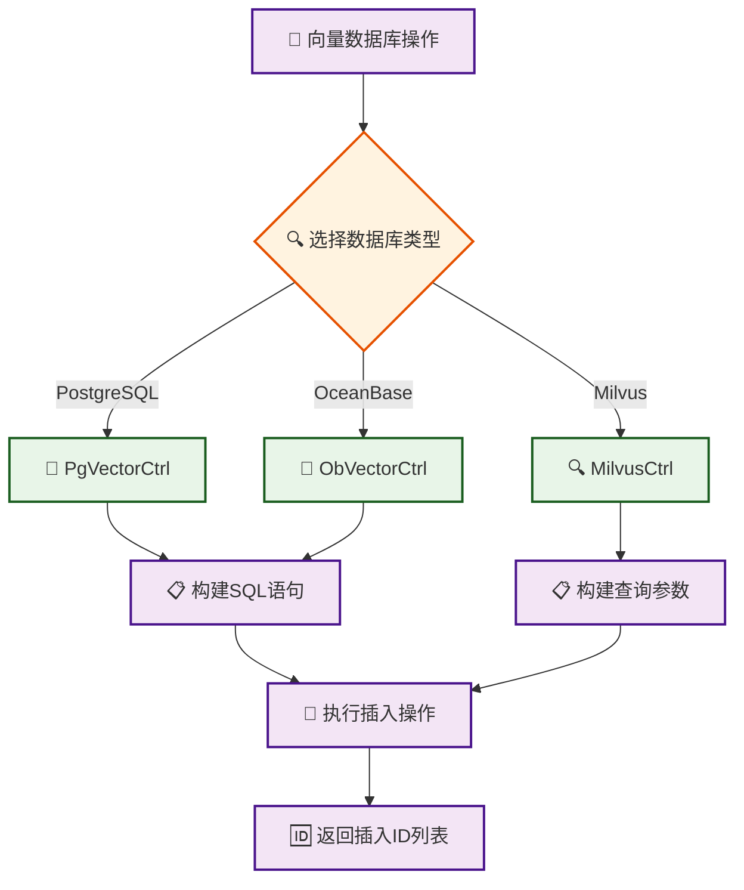
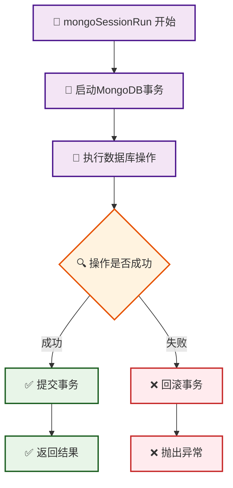
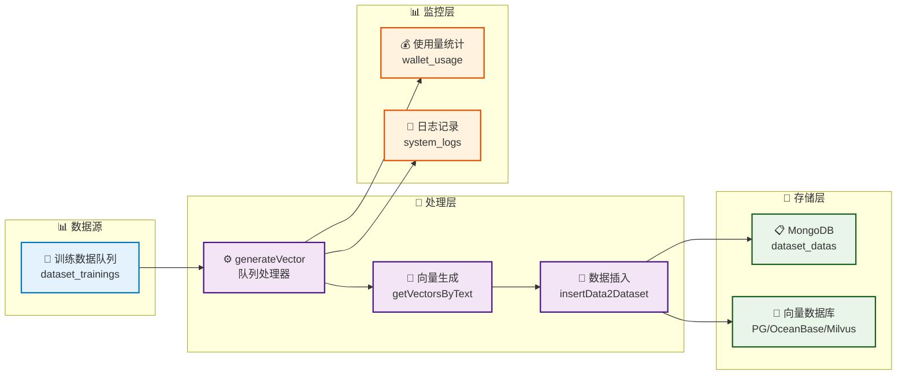
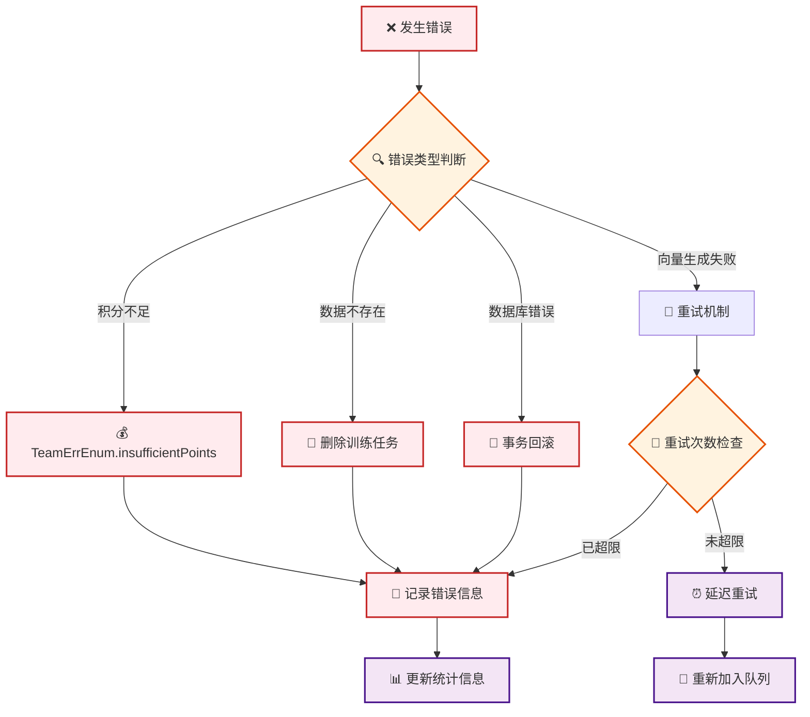

# FastGPT 训练数据生成向量完整流程图

## 概述

本文档详细描述了以 `generateVector` 为入口的训练数据生成向量的完整流程，包括数据处理、向量生成、数据库操作等各个环节。

## 主流程图

## 详细子流程图

### 1. insertData2Dataset 数据插入流程

### 2. getVectorsByText 向量生成流程

### 3. 向量数据库操作流程

### 4. 数据库事务处理流程

## 数据流转架构图

## 关键技术特性

### 🔄 并发控制
- 全局队列长度限制
- 乐观锁防止重复处理
- 任务锁定时间管理

### 💾 数据一致性
- MongoDB事务支持
- 原子性操作保证
- 错误回滚机制

### 🎯 性能优化
- 批量向量生成(每批20个)
- 异步处理机制
- 智能重试策略

### 📊 监控统计
- Token使用量记录
- 详细日志追踪
- 错误信息统计

## 错误处理机制

---

*本文档基于 FastGPT 源码分析生成，详细展示了训练数据向量化的完整流程。*